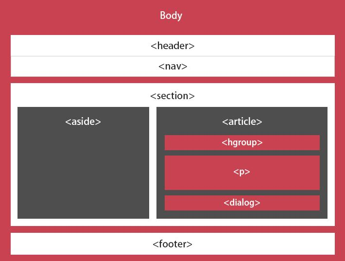
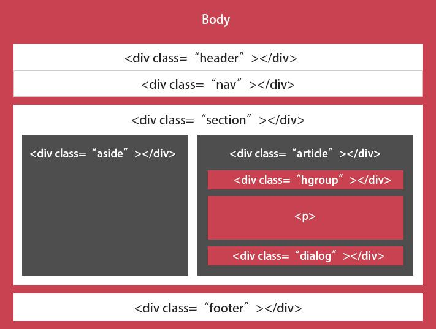

# HTML5学习
## web增强与垄断
### webApp
  ```
 新特性:离线存储,表单,JS线程,socket,标准扩展embed,css3
  ```
### 流媒体与多媒体引擎
```
 Audio,video,Canvas,webgl
 ```
### 搜索引擎和无障碍领域
 
## 移动互联网
* ### 跨平台
* ### 快速迭代
* ### 减低成本
* ### 导流入口多
* ### 分发效率高

### 目前支持HTML5的浏览器有:

<div align="center" >


<div>

## 概念


 
#### HTML 5 ≈ HTML+CSS 3+Javascript+API
 
 
## 标准改变
### 不是SGML/XML

####  HTML5 并不是定义为SGML或者XML的应用程序。
   
### DTD

#### HTML5的DTD声明中不需要使用DTD文件
 
  
## 新增标签
### 结构标签  --- 有意义的div

块状元素     | 作用
-------- | ---
< article> | 定义一篇文章
< header>    | 定义一个页面或者区域的头部
< nav>   | 定义导航栏链接
< section>   | 定义一个区域
< aside>   | 页面侧边栏
< hgroup>  | 文件中一个区位的相关信息
< figure>   | 定义一组媒体的内容以及标题
< figcaption>   | 定义figure元素的标题
< footer>   | 标记定义一个页面或一个区域的底部
< dialog>   | 标记定义一个对话框(会话框)类似微信

### 多媒体标签
类多媒体标签     | 作用 
-------- | ---
< video> | 标记定义一个视频
< audio>    | 标记定义音频内容
< source>   | 标记定义媒体资源
< canvas> | 标记定义图片
< embed>  | 标记定义外部的可交互的内容或插件,比如flash

### web应用标签
> 状态标签
 
状态标签     | 作用
-------- | ---
< meter>| 状态标签(实时状态显示:气压、气温)C、O
< progress>    | 状态标签 (任务过程:安装、加载) C、F、O

> 列表标签

列表标签     | 作用
-------- | ---
< datalist>| 为input标记定义一个下拉列表,配合option F、O
< details>    | 标记定义一个元素的详细内容 ,配合summary C

> Menu 

 Menu     | 作用
-------- | ---
< menu>| 命令列表(目前所有主流浏览器都不支持)
< menuitem>    | menu命令列表标签(只有FireFox8.0+支持)
< command>    | menu标记定义一个命令按钮(只有IE9支持)

### 其他标签
  
   注释标签     | 作用
  -------- | ---
  < ruby>| 标记定义注释或音标
  < rp>   | 告诉那些不支持 ruby元素的浏览器如何去显示
  < rt>    | 标记定义对ruby的注释内容文本
  < mark>  | 标记定义有标记的文本 (黄色选中状态)
  < output>  | 标记定义一些输出类型,计算表单结果配合oninput事件
  < keygen>    | 标记定义表单里一个生成的键值(加密信息传送)
  < time>   | 标记定义一个日期/时间,目前所有主流浏览器都不支持

### 删除的标签
  删除标签     | 作用
  -------- | ---
  纯表现的元素| basefont、big、center、font、s、strike、tt、u
  对可用性产生负面影响的元素   | frame、frameset、noframes
  产生混淆的元素   | acronym、applet、isindex、dir

### 重定义标签
 > 显示不变,只是表达的含义进行了重新定义的标签
 
 重定义标签     | 作用
   -------- | ---
   < b>| 粗体
   < i>   | 斜体
   < dd>   | 可以与detail和figure一同使用,定义包含文本,dialog也可使用
   < dt>   | 可以与detail和figure一同使用,汇总细节,dialog也可使用
   < hr>   | 表示主题结束,而不是水平线,虽然显然相同
   < menu> | 重新定义用户界面的菜单,配合commond或者menuitem使用
   < small>  | 表示小字体,例如打印注释或者法律条款
  < strong> | 表示重要性而不是强调符号
  


## HTML5属性变化


 
1. ### Input


#### email/url/number/range/Date picker/search/color/tel

2. ### 表单属性


#### autocomplete/autofocus/multiple/placeholder/required


3. ### 链接属性


#### size/target/超链接


3. ### 其他属性

#### script/ol/html/style


> manifest=“cache.manifest”(定义页面离线应用文件) <html manifest=“cache.manifest”>
> scoped:内嵌CSS

### 新布局的意义

#### 语义化

> HTML5 可以让很多更语义化的结构化代码标签代替大量无意义的 div 标签
1. ##### 这种语义化的特性提升了网页的质量和语义
2. ##### 减少了以前用于CSS 调用的class 和 id 属性
3. ##### 对搜索引擎的友好 
 > 新的结构标签带来的是网页布局的改变及提升对搜索引擎的友好
 
 <div align="center" >
 
 
 <div>